# GMA Store POS — Core Store Flow UI/UX Audit

Date: 2026-10-02  
Primary viewport: 390×844  
Responsive spot checks: 768×1024 and 1440×900  
Mode: Combined UX and accessibility audit  
Goal: Faster daily use for cashiers and store managers

## Overall verdict

The product already has a coherent visual identity, fast local-first behavior, and several well-designed transaction controls. Search, weighted-item editing, restocking previews, payment defaults, and offline queuing are strong foundations.

The largest problems are structural rather than decorative. The application shell does not adapt cleanly to role or viewport, mobile cart controls obscure content even when empty, tablet layouts waste substantial space, and checkout dialogs do not manage keyboard focus safely. The redesign should keep the product’s green-and-cream character and offline model while rebuilding the shell, cart, checkout, and responsive behavior around the actual device and role.

## Audit scope and evidence

The run used an isolated local store with manager and cashier accounts, nine representative products, weighted and bulk-unit cases, low/out-of-stock cases, one utang customer, an online utang sale, a restock, a payment, and an offline cash sale. Existing store data was not used.

### 1. Shared-store sign-in — Mixed

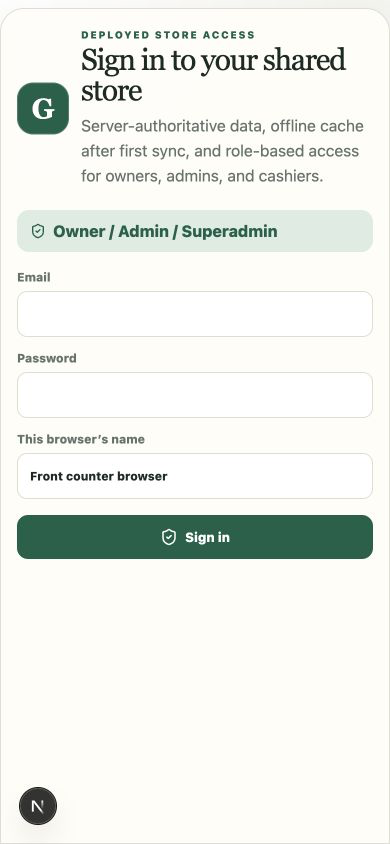

- Strength: Clear title, visible field labels, large controls, and a calm first impression.
- Risk: “Owner / Admin / Superadmin” combines three different roles into one long choice without explaining why they share a path.
- Accessibility: Labels are present, but the page copy is longer than needed for a repeat-use operational screen.

### 2. Populated Sell screen — At risk

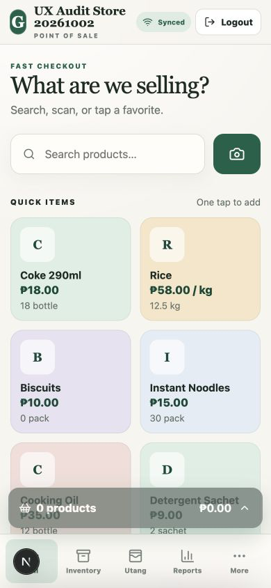

- Strength: Search, scan, and one-tap products are immediately discoverable.
- Risk: The disabled cart bar remains fixed above navigation and covers product cards even when the cart is empty.
- Risk: Out-of-stock and low-stock items look as actionable as healthy products.
- Risk: Logout competes with selling in the most valuable phone header space.

### 3. Product search — Healthy with shell issues

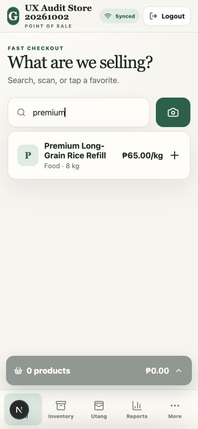

- Strength: The result row is compact, readable, and exposes name, stock, category, price, and a clear add action.
- Risk: The crowded header clips the store identity at phone width.
- Opportunity: Keep the result pattern, but move account/logout out of the transactional header.

### 4. Mobile cart — Mixed

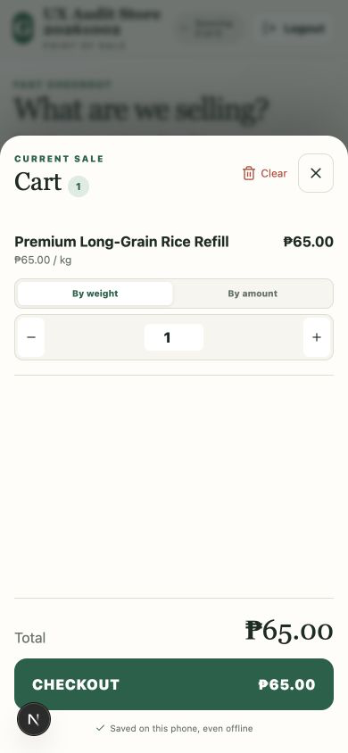

- Strength: Product, unit price, entry mode, quantity, total, and checkout action are clearly grouped.
- Strength: Weighted sales support both weight and peso-amount entry.
- Risk: A single-line cart uses an almost full-height drawer with large unused space.
- Accessibility: The visually closed cart remains present in the accessibility tree and contains focusable controls; it needs `inert` or equivalent hidden-state management.

### 5. Cash checkout — Mixed

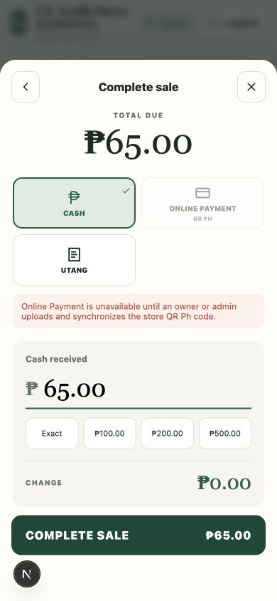

- Strength: Exact cash is prefilled; common cash shortcuts and calculated change reduce effort.
- Risk: Back and close perform the same action, adding an unnecessary decision.
- Risk: The unavailable online-payment warning occupies space on every payment method instead of appearing only when relevant.
- Accessibility: When opened, focus remained on the checkout button behind the modal, and underlying page controls remained exposed in the accessibility tree.

### 6. Utang customer selection — Mixed

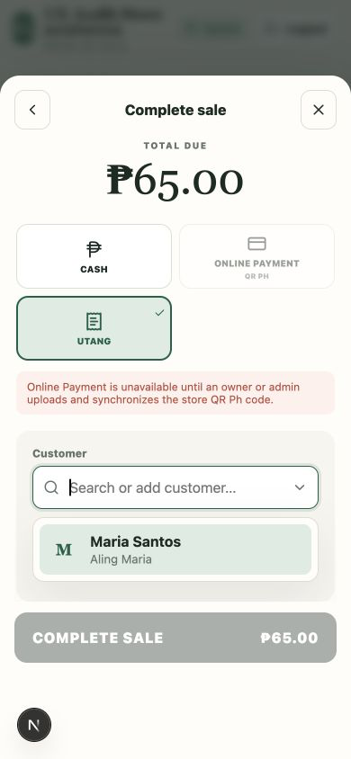

- Strength: Customer search and selection are understandable and work in the same checkout context.
- Risk: The unrelated online-payment warning remains visible after Utang is selected.
- Risk: “Search or add customer” hides two different actions in one field; creation needs a clearly announced option and status.

### 7. Sale completion — Mixed

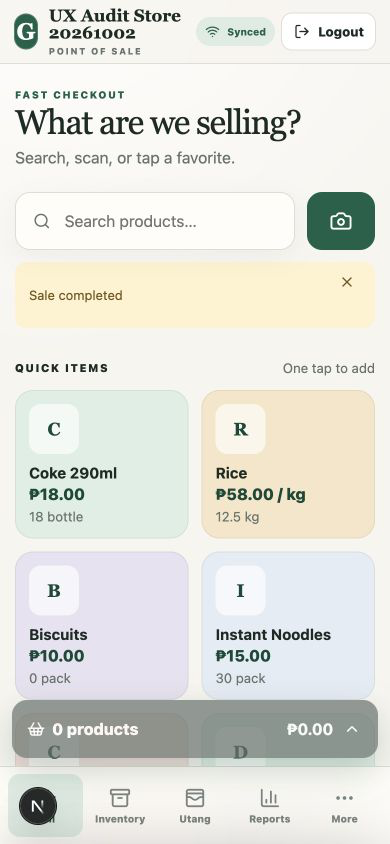

- Strength: The cart clears and the cashier can immediately begin another transaction.
- Risk: “Sale completed” does not repeat amount, payment type, customer, change, or transaction reference, so the cashier has little reassurance that the correct sale was recorded.
- Accessibility: The transient notice is not exposed as a live status message.

### 8. Inventory list — Mixed

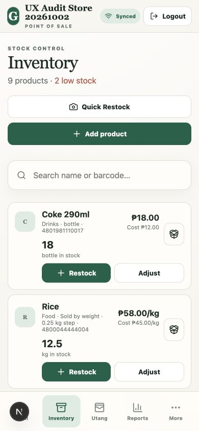

- Strength: Rows expose stock, price, cost, barcode, and direct restock/adjust actions.
- Risk: Only two products fit on a phone screen, while the stated “2 low stock” products are not surfaced first or available as a filter.
- Risk: The unlabeled edit icon is visually ambiguous.
- Opportunity: Make Quick Restock the primary action, offer a low-stock filter, and use denser rows.

### 9. Weighted restock entry — Healthy

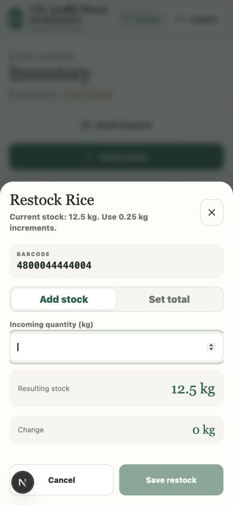

- Strength: Current stock, required increment, barcode, mode, and resulting stock are all available before committing.
- Accessibility: The modal receives input focus and provides explicit labels.

### 10. Restock preview — Healthy

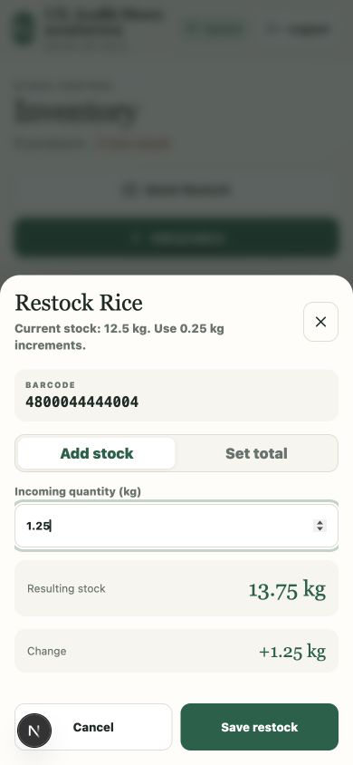

- Strength: The result and delta update before saving, which prevents common counting mistakes.
- Recommendation: Preserve this preview-first pattern throughout inventory adjustments.

### 11. Utang ledger — Mixed

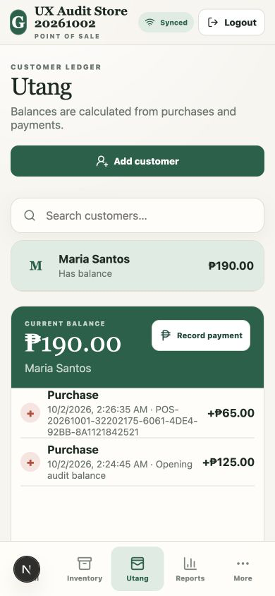

- Strength: Customer balance and payment action are prominent, with purchase history directly below.
- Risk: Full transaction UUIDs wrap across several lines and dominate the useful date, type, and amount information.
- Risk: Add-customer, search, customer list, balance, and ledger all stack vertically; this makes frequent ledger review slower on phones.

### 12. Record payment — Healthy

- Strength: The full balance is prefilled, the resulting action is unambiguous, and overpayment behavior is explained.
- Recommendation: Reuse this compact, single-decision modal model for other financial adjustments.

### 13. Paid-up ledger — Healthy with density issues

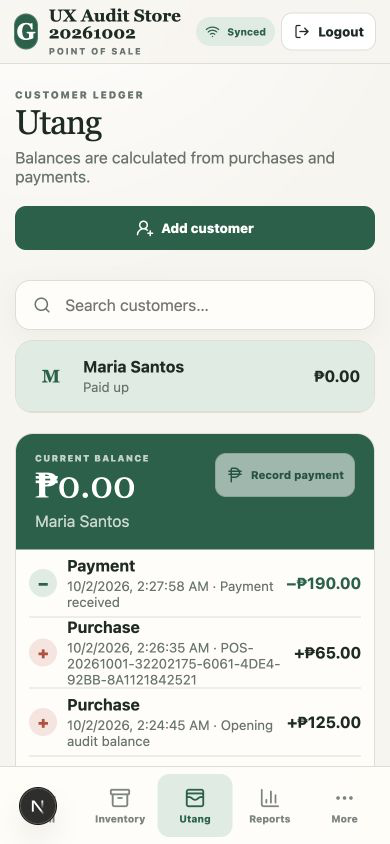

- Strength: Paid-up state, disabled payment action, and the balancing payment are immediately visible.
- Risk: Transaction metadata remains overly dense and should hide technical identifiers behind details.

### 14. Cashier sign-in — Mixed

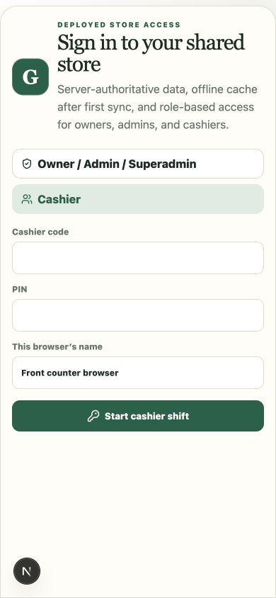

- Strength: Cashier code and PIN are appropriately simpler than manager credentials.
- Risk: The manager role label is still long and visually dominant beside the cashier choice.
- Opportunity: Make role selection a short, explicit two-choice entry: “Manager” and “Cashier.”

### 15. Cashier workspace — At risk

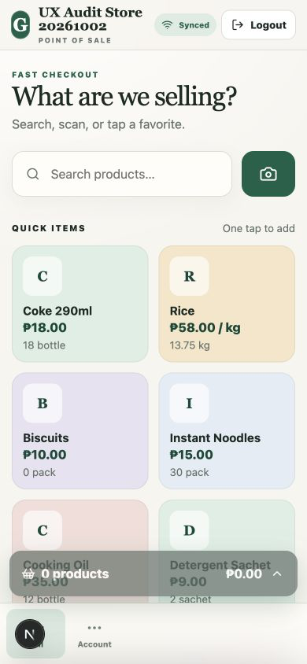

- Strength: Manager-only areas are correctly removed.
- Risk: The navigation still uses a five-column grid for two actions, leaving most of the bar empty and putting the two items at the left edge.
- Accessibility: The active Sell item has no semantic `aria-current` or selected state.

### 16. Offline state — Healthy with copy issues

- Strength: Selling remains available and the connection state changes without interrupting the cashier.
- Risk: The compact status pill wraps into three lines and consumes scarce header width.

### 17. Offline sale queued — Healthy

- Strength: The sale completes locally, inventory updates, and the queue count becomes visible before syncing successfully on reconnection.
- Risk: “Offline · 1 sales” is grammatically incorrect and does not distinguish pending sales from other pending changes.
- Recommendation: Use “Offline · 1 pending sale” and expose a tap target for queue details.

### 18. Tablet layout — At risk

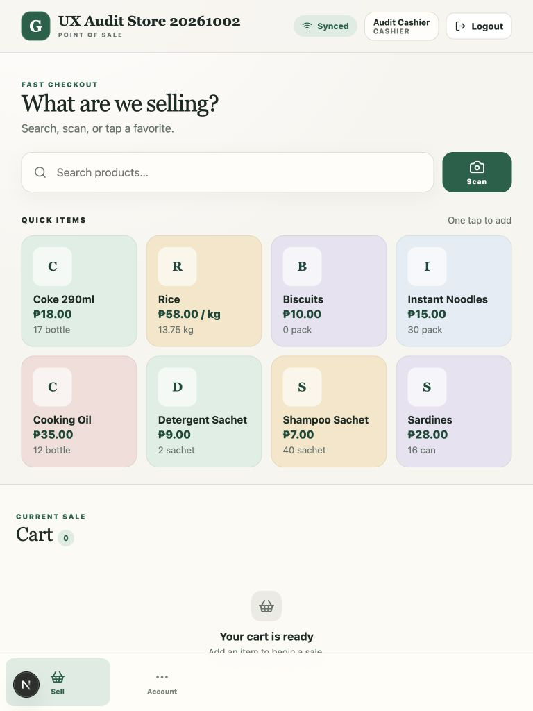

- Risk: At 768 px, the cart is placed below the product grid instead of becoming a useful second pane, forcing scrolling and producing a large empty cart region.
- Risk: The mobile bottom navigation remains while the header has already switched to a wider-screen layout.
- Recommendation: Introduce a two-pane Sell workspace at tablet widths and a role-adaptive rail or top navigation.

### 19. Desktop layout — Mixed

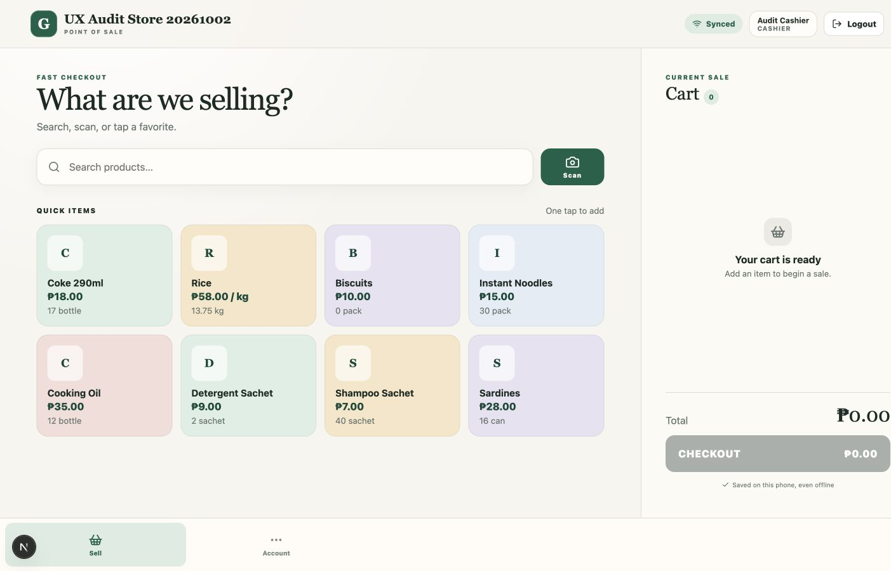

- Strength: The product/cart split is clear and quick items fit comfortably.
- Risk: The fixed mobile bottom navigation remains on desktop and uses only two of five columns for cashiers.
- Risk: Empty-state whitespace is excessive; the cart could instead offer recent-item, held-sale, or keyboard guidance without becoming noisy.

### 20. Keyboard focus — At risk

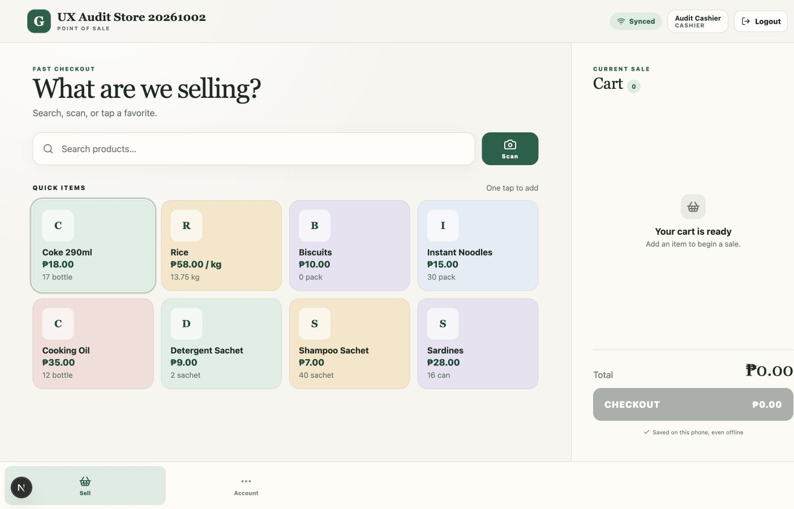

- Strength: Focus is visibly drawn around interactive cards.
- Accessibility risk: The configured focus outline composites to roughly 1.5:1 against the paper, mint, and surface backgrounds, below the 3:1 non-text contrast target.
- Accessibility risk: Modal focus containment is inconsistent—`AppModal` traps focus, while checkout uses a separate behavior that does not.

### 21. Out-of-stock feedback — At risk

- Strength: The app prevents an invalid item from entering the cart.
- Risk: The product card looks enabled, so the cashier must tap it to learn it cannot be sold.
- Accessibility: The resulting message is not a live alert/status and may not be announced.

## Confirmed strengths

- Offline transactions are durable, visible, and synchronize after reconnection.
- Search and quick-item discovery are fast and understandable.
- Weighted products support quantity and peso-amount entry.
- Cash checkout defaults and restock/payment previews reduce calculation effort.
- Core color pairs meet WCAG AA for normal text: ink/paper 13.73:1, muted/paper 4.55:1, green/paper 6.81:1, white/green 7.42:1.
- Touch targets are generally at least 44 px on phone layouts.
- Reduced-motion support is present.

## Highest-impact redesign changes

### P0 — Accessibility and interaction safety

1. Replace separate modal behaviors with one dialog primitive that moves focus inside, traps Tab/Shift+Tab, returns focus, and makes the page behind the dialog inert.
2. Remove `maximumScale: 1` so users can zoom; verify 200% zoom and responsive reflow.
3. Increase focus-indicator contrast to at least 3:1 on every surface.
4. Add semantic state: `aria-current` for navigation, `aria-pressed` or radio semantics for payment methods, and live regions for sale, stock, offline, and error messages.
5. Make the closed mobile cart inert and remove it from the accessibility tree until opened.

### P1 — Faster cashier workflow

1. Rebuild the shell by role and viewport: compact phone header, dynamic two-item cashier navigation, full manager navigation, and rail/top navigation on wider screens.
2. Hide the mobile cart bar while empty; show it only after the first item is added.
3. Disable or clearly mark out-of-stock products before interaction; add low-stock indicators without relying on color alone.
4. Make the cart drawer content-sized for short carts, with a sticky total and checkout action.
5. Show only the selected payment method’s guidance; remove the unrelated QR warning from Cash and Utang.
6. Upgrade completion feedback to include amount, payment type, customer/change when relevant, and a short transaction reference.

### P2 — Manager efficiency and information density

1. Add an immediately available low-stock filter and sort urgent inventory first.
2. Use denser inventory rows while preserving direct Restock and Adjust actions.
3. Simplify ledger rows to type, friendly date/time, note, and amount; place UUIDs and technical details behind an expandable detail view.
4. Keep the successful preview-before-save model for restock, adjustment, and payment flows.
5. Replace fixed breakpoint behavior with layout rules based on available workspace: phone drawer, tablet two-pane, desktop two-pane plus adaptive navigation.

## Full-redesign direction

- **Phone:** Store name and compact sync control in the header; account/logout under Account. Search and scan stay fixed near the top. Quick products show availability states. A cart summary appears only when populated and opens a content-sized bottom sheet.
- **Tablet:** Persistent product/search workspace on the left and cart on the right. Manager navigation becomes a compact rail or top tab row instead of a mobile bottom bar.
- **Desktop:** Dense product grid with keyboard-first search and a stable cart column. Replace the bottom bar with role-aware primary navigation.
- **Checkout:** One semantic payment selector, one contextual detail panel, and one sticky completion action. Do not show warnings for unselected payment methods.
- **Inventory and Utang:** Prioritize exceptions and balances, reduce technical metadata, and preserve the strong preview/confirmation patterns.
- **Sync:** Use short states—Synced, Offline, Syncing, Needs attention—with pending counts and a details view when action is required.

## Implementation and test roadmap

### Phase 1: Shell and accessibility foundation

- Build a shared dialog primitive and migrate checkout, product form, scanner, and confirmation flows.
- Make navigation columns and labels role-aware; move logout into Account on phone.
- Fix zoom, focus contrast, semantic selected states, live regions, and hidden-cart behavior.
- Acceptance: keyboard users cannot focus obscured content, all dialogs pass focus-entry/trap/return tests, and phone headers do not clip at 320–430 px.

### Phase 2: Sell, cart, and checkout redesign

- Implement adaptive phone/tablet/desktop Sell layouts.
- Add availability badges/disabled states, contextual cart sizing, contextual payment guidance, and detailed completion feedback.
- Acceptance: a cashier can add a quick item and complete a cash sale without scrolling at 390×844; tablet Sell remains two-pane at 768×1024.

### Phase 3: Inventory, utang, and sync refinement

- Add low-stock filtering/sorting, denser product rows, simplified ledger history, and a pending-sync details surface.
- Acceptance: low-stock products are reachable in one action; ledger rows avoid UUID wrapping; offline sale count uses correct singular/plural copy and reconciles after reconnect.

### Regression coverage

- Visual checks at 390×844, 768×1024, and 1440×900.
- Role checks for manager five-area navigation and cashier Sell/Account navigation.
- Keyboard checks for search, quick items, cart, payment methods, customer comboboxes, and every dialog.
- Automated semantic checks for current navigation, selected payment method, live notices, labels, and inert hidden content.
- Offline end-to-end check: complete sale, see pending count, reconnect, and reach Synced without duplicate sale creation.

## Evidence limits

- Camera permission and a physical barcode scanner were not exercised; search and keyboard-accessible barcode behavior were inspected instead.
- QR Ph checkout remained unavailable because the isolated store had no uploaded merchant QR code.
- No screen-reader session was run, so assistive-technology findings are based on the accessibility tree, keyboard behavior, markup, and screenshots.
- Contrast calculations covered the principal design tokens and focus outline, not every translucent or image-backed state.
- The black circular Next.js control in screenshots is a development-only overlay and is not treated as a production UI defect.
